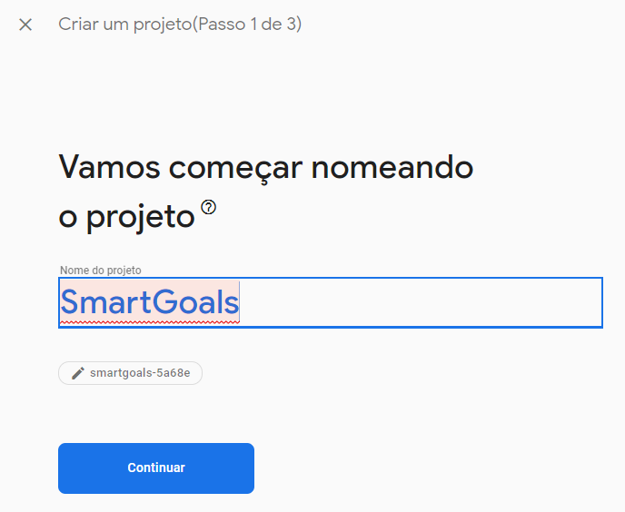
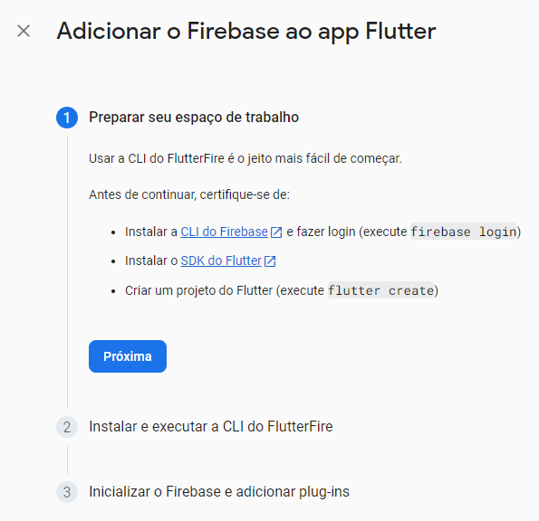
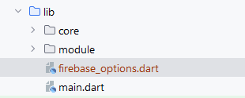
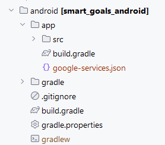

# smart_goals

Um aplicativo para criação de metas.

## Getting Started

Configurações:

- Crie um projeto no [Firebase](https://firebase.google.com)  
 
- Adicione um app na versão Flutter e siga as instruções  
  
  
- Após isso a classe DefaultFirebaseOptions no arquivo firebase_options.dart criada  
  
